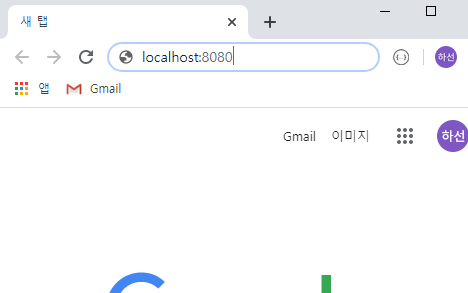

# Spring Boot 

스프링 부트

- 웹 애플리케이션 제작

- Java, HTML/CSS/JS, Database + Spring
  - 엑셀 <=> database

  - 시트 <=> table

  - 열 <=> column

    

1.  다운로드  https://spring.io/tools

2. 다운로드 폴더 -> 파일 -> Windows powerShell 

   - java  -jar sp[tab]

   - 만약에 안된다면, 

     -- 제어판 -> 시스템-> 고급 시스템설정 -> 자바를 환경변수에 추가하거나

     -- powerShell에 자바가 있는 폴더를 먼저 지정해야함. 

   ㅇdev 폴더에(최대한 단순하게)  Spring Tool Suite4 열기. 

3. Lombok 다운로드  https://projectlombok.org/all-versions

   - set, get 을 (눈에 보이지 않지만) 자동으로 추가해줌.  1.18.10v
   - java -jar rom[tab]
   - spring tool suit4 .exe 파일 선택  

4.  spring tool suit4 -> restart 하기. 

5. 


src/main/java>>>main(String[]):void  ctrl f11

---------------------------

클라이언트 ->(request) -> 서버

java,javascript					spring

c, python...						Node.js, JSP,Django....

클라이언트 <-(response)<- 서버

-----------------

## Controller

- html 파일을 불러와서 사용자가 보는 언어와 분리해냄. 

- 사용자가 보지 않는 언어들 html 들은 view(Jsp)에 저장됨. 

- DBMS 에서 온 것을 종합함. 

- 클라이언트 - controller - model(DAO) - DBMS

​						viwe(Jsp)


----------

### 기본 controller 코드 실행

```java
package com.start_spring.basic.controller;

import org.springframework.web.bind.annotation.GetMapping;

//Shift + Ctrl + O : 전체 import
@RestController
public class TestController {
	@GetMapping("/test")
	public String test() {
		return "Hello-"; //<h1>hello<h1> html 태그도 가능. 
	}
}

```




- 웹  접속

- 뒤에 /test 를 붙이면 hello - 가 출력된다.

- 다시 출력하려면 저장하고, 빨간 멈춤 버튼 누르고 다시 실행한다. 

--------------

### Rest 가 없는 controller

@controller 를 사용해야 html 문서를 return 할 수 있다. 

```java
package com.start_spring.basic.controller;

import org.springframework.stereotype.Controller;
import org.springframework.web.bind.annotation.GetMapping;

@Controller
public class Test2Controller {
	@GetMapping("/test2")
	public String test2() {
		return "hello"; //"hello" 이름의 html 문서를 return 함. 
	}

}

```


resources > templates 안에 **hello.html** 파일 만들었음. 

```html
<!DOCTYPE html>
<html>
<head>
<meta charset="EUC-KR">
<title>Insert title here</title>
</head>
<body>

	<h1>헬로우!!</h1>

</body>
</html>
```


즉, html 스타일을 나타내는 2가지 방법이 있다. 

- @RestController : 이 페이지에서 html 적용
- @Controller : Templates 안에서 html 소스 파일 만들기. 

----------

### STS 인코딩 설정 변경(한글이 깨지는 경우)


```html
<!DOCTYPE html>
<html>
<head>
<meta charset="utf-8"> // 변경 !!!!!
<title>Insert title here</title>
</head>
<body>

	<h1>헬로우!!</h1>

</body>
</html>
```

그러면 아까 /test2에서 깨진 한글이 바르게 나온다. 

------------------------

# Log -Logger 사용

1. lombok을 통해 log 사용 -> @ Slf4j , log
2. lombok을 통하지 않고 직접 사용 -> logger

```java
package com.start_spring.basic.controller;

import org.slf4j.Logger;
//import org.slf4j.LoggerFactory;
import org.springframework.stereotype.Controller;
import org.springframework.web.bind.annotation.RequestMapping;

import lombok.extern.slf4j.Slf4j;

@Slf4j
@Controller
public class HomeController {
	// 1. 출력속도가 빠르다 
	// 2. 파일 등을 이용하여 관리가 용이함 
	// Logger logger = LoggerFactory.getLogger(this.getClass()); 이것은 lombok 을 사용하지 않을 때 쓰고, 밑에 log 를 logger 로 바꾼다. 
	
	 //Shift + Alt + A : 열 편집 
	@RequestMapping("/")
	public String home() { //public String 은 html 로 응답을 줌. 반면에 public map 은 JSON 으로 응답을 준다. 
		log.trace("trace!");
		log.debug("debug!"); // 개발단계에서 확인용
		log.info("info!"); // 운용 상 필요한 정보
		log.warn("warning!"); // 메모리 문제 등 경고
		log.error("error!"); // 치명적인 오류 
		          
		return "home";
	}
}

```


3. 위 사진과 같은 **application.properties에 **`logging.level.com.start_spring.basic=trace`  입력한다.


## devtools 실행

>controller 파일을 실행할때 마다 서버를 껐다 켰다 해야 하는데, 그럴 필요 없이 계속 서버를 운영하게 해주는 기능.

1. build.gradle 에 implementation "org.springframework.boot:spring-boot-devtools" 입력

우클릭 gradle -> refresh


2. 다시 hometest 에서 실행한 후 조금 수정(띄어쓰기) 하면 하늘색으로 console창이 변한다. 

---------------

## HtmlController

controller package 에 **HtmlController.java**  생성

```java
package com.start_spring.basic.controller;

import java.util.HashMap;
import java.util.Map;

import org.springframework.stereotype.Controller;
import org.springframework.ui.Model;
import org.springframework.web.bind.annotation.GetMapping;
import org.springframework.web.servlet.ModelAndView;

import com.start_spring.basic.model.Member;

@Controller
public class HtmlController {
	@GetMapping("html/string")
	public String html() {
		return "html/string";
	}

	@GetMapping("html/void")
	public void htmlVoid() {
	}

	@GetMapping("html/map")
	public Map<String, Object> htmlMap(Map<String, Object> map) {
		Map<String, Object> map2 = new HashMap<String, Object>();
		return map2;
	}

	@GetMapping("html/model") //Model 은 요청받은 parameter를 html로 나타내기 위해 import 한다.
	public Model htmlModel(Model model) {
		return model;
	}

	@GetMapping("html/model_and_view")
	public ModelAndView htmlModel() {
		ModelAndView mav = new ModelAndView();
		mav.setViewName("html/model_and_view");
		return mav;
	}

	@GetMapping("html/object")
    @ResponseBody // html에 출력 결과를 JSON 형태로 보여줌. 
	public Member htmlObject() { //Member class는 model 패키지 안에 있음. 
		Member member = new Member();
		member.setName("kim"); 
		return member;
	}
}
```


## Html controller - Member.java

1. com.start_spring.basic 에 model 패키지 생성하고 그 안에 Member.java 생성한다.

2. 만약에 lombok 을 실행하지 않은 직접 사용의 경우, userPassword 다음 줄에 getter setter 또는 toString 을 생성시킨다.

```java
package com.start_spring.basic.model;

import lombok.Data;

@Data
public class Member {
	private String name;
	private String userId;
	private String userPassword;
//lombok 을 사용하지 않은 경우 getter setter 혹은 toString 실행. 


}
```


3. templates 아래 html 패키지를 만들고 그 아래에 각 html 문서를 만든다. 

----------

**mvc = html 문서를 return 하는 방식 **

---------------

### object를  JSON 형식으로 보기

**@ResponseBody** //JSON 형식으로 바꾸어줌 -> (public Member htmlObject() )

```java


	@GetMapping("html/object")
	@ResponseBody //JSON 형식으로 바꾸어줌. 
	public Member htmlObject() {
		Member member = new Member();
		member.setName("Shin");
		member.setUserId("hahaha");
		member.setUserPassword("모름");
		
		return member; //위 내용들을 담아낸 model 패키지에 있는 member class 를 출력함. 
	}
}
```


## 중요 ! 요청에 대한 응답 방식

- HTML 은

  => **string** 으로! 응답함. 예시: `public string login(){`

  ​											`return "login";`}`

- JSON

  => map, array, list, object //**@ResponseBody**

(예시)

```java
package com.start_spring.basic.controller;

import java.util.ArrayList;
import java.util.HashMap;
import java.util.List;
import java.util.Map;

import org.springframework.stereotype.Controller;
import org.springframework.web.bind.annotation.GetMapping;
import org.springframework.web.bind.annotation.ResponseBody;

import com.start_spring.basic.model.Member;


@Controller
public class Json1Controller {
	// API Server

	@GetMapping("json/string")
	@ResponseBody
	public String json() {
		return "json/string";
	}

	@GetMapping("json/map")
	@ResponseBody
	public Map<String, Object> jsonMap(Map<String, Object> map) {
		Map<String, Object> map2 = new HashMap<String, Object>();
		map2.put("key1", "value");
		map2.put("key2", 2324);
		map2.put("key3", true);
		return map2;
	}


	@GetMapping("json/object")
	@ResponseBody
	public Member jsonObject() {
		Member member = new Member();
		member.setName("kim");
		return member;
	}

	@GetMapping("json/list")
	@ResponseBody
	public List<String> jsonList() {
		List<String> list = new ArrayList<>();
		list.add("1");
		list.add("2");
		list.add("3");
		return list;
	}
}

```

-----

RestController 를 사용하면 Restbody 없이도 JSON 을 사용할 수 있다!!

--------------------

## http method

- POST /GET/ PUT/ DELETE
-  GET – 데이터를 가져오기 ● POST – 데이터 저장 ● PUT – 데이터 수정 ● DELETE – 데이터 삭제

restlet client설치

jason formatter 설치

------

### 요청 처리(name을 받는 것)

>Controller 에서 parameter를 받는 방법은 다양하다
>
>

#### 1. RequestParam (편리함)

client 가 server 에게 parameter를 얼마나 넘기든 다 받아준다. 

예시 :`@RequestParam("key1") String key1`

만약에, 배열을 받는다거나 리스트를 받으면 parameter를 명확히 쓰지 않는다. 

#### 2. ModelAttribute(명확함)

정확한 형식의 data를 넘겨야 한다. 

### 3. PathAttribute

경로 자체를 변수로 씀.


-------

# 로그인 화면 만들기


```java
package com.start_spring.basic.controller;

import org.springframework.stereotype.Controller;
import org.springframework.web.bind.annotation.GetMapping;
import org.springframework.web.bind.annotation.PostMapping;
import org.springframework.web.bind.annotation.RequestParam;
import org.springframework.web.bind.annotation.ResponseBody;

@Controller

public class LoginController {
	@GetMapping("/login")
	public String login() {
		return "login"; //login.html 에서 작업한 내용을 나타내라. 
	}
	@PostMapping("/login") //입력된 정보를 (아이디,패스워드) 서버에 전달하기 위해 post 방식으로..
	@ResponseBody //꼭 post 뒤에 쓰기 ! JSON 형식으로 정보를 가져올 것이라는 뜻. 
	
	public String loginPost(
			@RequestParam("id") String id, //"id" 는 login.html 에서 name.
			@RequestParam("pw") String pw) {//큰따옴표 없는 id와 pw 는 아래에 주는 변수. name 값을 받은 변수.
		
		String dbId = "boot";
		String dbPw = "1234";

		if(dbId.equals(id) && dbPw.equals(pw)) {
			return "로그인 성공";
			
		}
		
		return "로그인 실패";
	}

}

```

**login.html**

```html
<form method="post" action="/login">
	ID : <input type="text" name="id"><br>
	PW : <input type="text" name="pw"><br>
	<input type="submit">
</form>
```

### 무조건 name 이 있어야 한다 !! 

Requestparam 을 통해서 name을 받는다 !! 

-------------

잠깐 상식 : REST 방식 -> 각 web page 에는 각 주소가 있어야 한다.

REST 방식이 아닌 다른 방식이라는 것은 업속, 잘 적용된것/ 지저분하게 적용된 것 같은 개념만 있다.


---------------------

##  HTML Template – Thymeleaf 

● 스프링 부트에서 권장하는 HTML Template ● HTML5 문법을 사용하는 HTML 태그 및 속성 기반의 Template Engine ● 텍스트, HTML, XML, JavaScript, CSS 등 생성 가능 ● Controller에서 View로 넘겨준 Model을 이용하여 데이터 출력

```java
package com.start_spring.basic.controller;

import java.util.ArrayList;
import java.util.HashMap;
import java.util.Map;
import java.util.List;

import org.springframework.stereotype.Controller;
import org.springframework.ui.Model;
import org.springframework.web.bind.annotation.GetMapping;


@Controller
public class Welcome {
	@GetMapping("/welcome")
			// HTML Template 에게 넘겨줄 데이터 
	public String welcome(Model model) {
		List<String> list = new ArrayList<>();
		list.add("a");
		list.add("b");
		model.addAttribute("key1", list);
		
		
		Map<String, Object> map = new HashMap<>();
		map.put("a", "value a");
		map.put("b", "value b");
		model.addAttribute("key2", map);
		
	
		
		
		return "Welcome";
		
	}
}
```


```html
[[${key1}]]
<br>
[[${key1[0]}]]
<br>
[[${key2}]]
<br>
[[${key2.a}]]
<br>
[[${key2['b']}]]
```

-----------------

 OOML

HTML

XML

문서상에서 사용되는 >< 들은 규칙이 존재한다.

그 규칙을 name spaces 라고 한다. 


-------------

## 페이지 화면 만들기

현재 내 페이지가 1페이지여도 1~ 10 이 나와야하고

3페이지여도 1~ 10 이 나와야한다.


내 숫자 페이지 에서 10을 나눔.


Page = 14 /10 => 1*10 => 10 +1 => 11

끝페이지 												11+9 => 20


```java
@GetMapping("pagination")
 public String pagination(Model model, @RequestParam(defaultValue="1") int page) { //default로 1페이지를 첫 화면으로 시작해라. 
 int startPage = (page - 1) / 10 * 10 + 1; //page -1 해야함 . !! 
 int endPage = startPage + 9; //끝번호는 더하기 9. 즉, 만약 2페이지가 시작이라면 2+ 9 = 11번까지 나옴. 
 model.addAttribute("startPage", startPage); //Html의 startPage name을 startPage 변수에 담음.
 model.addAttribute("endPage", endPage);
 model.addAttribute("page", page);
 return "pagination";
 }

```


```html
<!DOCTYPE html>
<html>
<head>
 <meta charset="UTF-8">
 <title>Insert title here</title>
</head>
<body>
 <th:block th:each="pageNumber : ${#numbers.sequence(startPage, endPage)}">
     //pageNumber는 startPage 부터 endPage 의 배열에 있는 모든 요소들. 
 <span th:if="${page} == ${pageNumber}" th:text="${pageNumber}" //th:text 써라. 
 style="font-weight:bold"></span> //현재 내 페이지는 굵게 표현. 
 <span th:unless="${page} == ${pageNumber}" th:text="${pageNumber}"></span>
 </th:block>
</body>
</html>
```


### 정리요약

컨트롤러 클래스 생성

=> 메소드(@GetMapping @Requestmapping)

@ResponseBody 또는 @RestController

JSON 또는 HTML


예쁘게 html 에 잘 표현하는 Tymeleaf.

