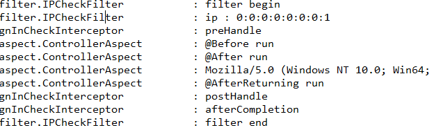
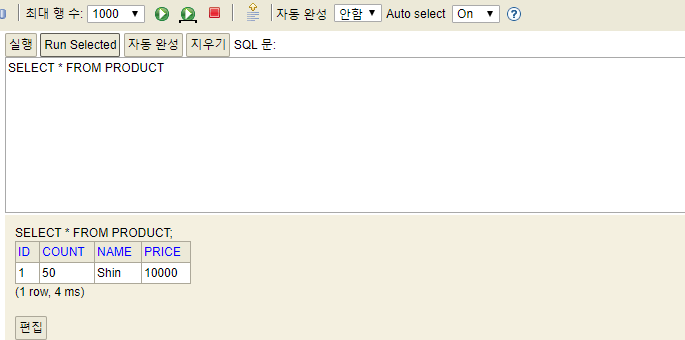

### 복습 개념

- lombok : set과 get 메소드를 자동으로 만들어주는 확장프로그램.

- 프로젝트 생성 : New -Spring Starter Project 

- Build tool : gradle, maven
  
- New Spring Starter Project Dependecies 에 미처 담지 못했던 기능을 build.gradle 에 넣어주면 된다. 
  
- MVM repository : java 프로그램에 필요한 라이브러리 검색 가능.

- Spring Web : 웹 프로젝트

- Thymeleaf : 뷰 템플릿 (화면에 보여주는 템플릿 기능). html 을 기준으로, Controller 에서 마련한 데이터를 동적으로 html의 모습으로 변화시켜줌. **${}** 이용해서 controller 에서 넘어온 정보를 처리해줌 **${}** 표시가 없으면 평범한 html임.

- 통신 흐름

  - 클라이언트가 서버에게 요청을 보내는 방식 
    - 4가지 : get, post, put, delete
      - put 과 delete는 드문 경우.
    - 요청할 때 추가로 보내는 데이터(아이디, 패스워드 등 )
      - parameter로 보냄.(get 방식일때는 물음표)
        - 서버에서 받는방법
        - 1. @RequestParam : 컨트롤러 메소드의 인자명과 동일. 물음표? 뒤의 파라미터(변수) 구체적으로 지정
          2. @ModelAttribute : 모델 **클래스의 변수명**과 동일 

  - 서버가 클라이언트에게 응답을 보내는 방식 
    - html 
    - JSON
    - 이미지 형태. (이미지 주소 복사 했을 때 나타나는 온전한 이미지) (이미지 바이너리 넘겨줌.)
    - 다운로드 파일 형태. (파일의 객체를 넘겨줌)

- 메소드의 다양한 return 타입

  - public **String** html(){    제일 많이 씀. **html 형식으로 리턴.** 

    ​			return "html/String"}

  -  public void htmlvoid() {

    ​			 }

  - @ResponseBody  **JSON 형태로 리턴. **
    - 그저 문자는 적용해도 그냥 문자열
    - map
    - member (미리 구현한 객체?클래스)
    - list
    - @RestController


## Springboot project gitgub upload

프로젝트 우클릭

1. team -> share project (컴퓨터 내 repository.  예시 경로 : c\dev\git\basic )

2. team -> commit -> 떠 있는 모든 파일 목록 ++ 클릭 -> add message

3. push and commit 

4. 로그인 및 github 저장 경로 설정. 


## page 번호에 link 부여하기

```java
package com.start_spring.basic.controller;

import java.util.ArrayList;
import java.util.HashMap;
import java.util.Map;

import org.springframework.stereotype.Controller;
import org.springframework.ui.Model;
import org.springframework.web.bind.annotation.GetMapping;
import org.springframework.web.bind.annotation.RequestParam;

import java.util.List;

@Controller
public class ThymeleafController {
	
	
	@GetMapping("/linkUrl")
	public String linkUrl(
//			@RequestParam int start,
//			@RequestParam int end,

        //@RequestParam 은 실제 브라우저 에서 ?뒤에 붙는 parameter 들을 요청하면서 보냄.  
        	@RequestParam(defaultValue="1") int now_page,
			Model model) {
		int start = (now_page -1) / 10 * 10 +1;
		int end = start + 9;
		model.addAttribute("start", start);
		model.addAttribute("end",end);
		model.addAttribute("now_page",now_page);
		
		return "linkUrl";
			
	}
```

**linkUrl**.html

```html
<th:block th:each=" page : ${#numbers.sequence(start,end)}">
	<span th:if= "${now_page == page}" th:text="${page}"></span>
	
	<a href ="#" th:unless ="${now_page==page}">[[${page}]]</a>


</th:block>
```


----------

## Session

1. 먼저, HTTP란?

Hyper Text Transfer Protocol [Secure]

- Stateless 특징

  client가 요청을 보내고 그에 대한 응답이 왔고 또 다시 똑같은 응답을 받고 싶지만, 서버는 이미 한 번 수행 한 후 기억을 못 하기 때문에 다시 똑같은 조건의(parameter 에 대한 값에 대한) 요청을 받아야 한다. 


2. 세션은 

- 클라이언트에 대한 정보를 서버에 저장할 수 있는 공간 

- 로그인이 아니라 접속하는 순간 생김. 
- 세션 만료 : 15분 정도 시간이 흐른 후 접속이 끊긴 것을 알려줌. 


3. 쿠키는 (세션과 대조적으로) client에 있는 공간

- client의 정보가 서버에 저장되는 공간.

- 서버가 client에게 부여하는 티켓은 브라우저의 임시공간(temp) 에 저장된다.  이것을 보통 쿠키라고 한다. 

- 예 ; 로그인 상태로 새로고침 해도 로그아웃이 되지 않음. 티켓을 가지고 있기 때문

  ​		


----------

## Session 관련 Login

```java
package com.start_spring.basic.controller;

import javax.servlet.http.HttpSession;
import org.springframework.stereotype.Controller;
import org.springframework.web.bind.annotation.GetMapping;
import org.springframework.web.bind.annotation.PostMapping;
import com.start_spring.basic.model.User;

@Controller
public class SessionController {
	@GetMapping("/login")
	public String login() {
		return "login";
	}

	@PostMapping("/login")
	public String loginPost(User user, HttpSession session) { // HttpSessin : 세션은 어디서든지 (현재 스프링 서버) 사용 가능 
		session.setAttribute("user", user);
        // setAttribute : 지정된 주소로 이동(떠넘김)
		return "redirect:/main"; //redirect : request가 왔으면 main 으로 던져서 main(.html)이 허락해준다.
	}

	@GetMapping("/main")
	public String main() {
		return "main";
	}
}
```


**model/User**.java

```java
package com.start_spring.model;
import lombok.Data;
@Data
public class User {
private String userId;
private String userPw;
}
```

**templates/login.html**

```html
<!DOCTYPE html>
<html>
<head>
<meta charset="UTF-8">
<title>Insert title here</title>
</head>
<body>
	<form action="/login" method="post">
		ID : <input type="text" name="userId"><br> 
        PW : <input type="password" name="userPw"><br> 
        <input type="submit" value="로그인">
	</form>
</body>
</html>

```

**templates/main.html**

```html
<!DOCTYPE html>
<html>
<head>
<meta charset="UTF-8">
<title>Insert title here</title>
</head>
<body>
	<p th:if="${session.user} != null" 
		th:text="${session.user.userId} + '님 반갑습니다.'"></p>
	<p th:unless="${session.user} != null">로그인되어 있지 않습니다.</p>
</body>
</html>
ml>

```

---------

 ## AOP(Aspect Oriented Programming)

**스프링의 2가지 특징**

1. IoC/DI (Inversion of Control / Dependency Injection)
   - requestPram, responseBody.. 과 같은 자동으로 만들어진 것들.
   - 제어의 역전. 스프링이 제어를 하게 됨. 
   - request, session, model 등  

2. **AOP**

   예시 : 로그인 했나 안 했나 판단 먼저 하는 것 .

   - 공통적으로 작용될 모듈(클래스/메소드)를 만든 후 적용하고자 하는 부분의 코드 밖에서 삽입하는 방법

   - 사용분야

     - 메소드의 성능 테스트. 

     - 트랜젝션 : 여러 단계를 하나로 묶어서 실시 

       임시저장 공간에서 하나라도 오류가 나면 기존에 있던 작업을 완전히 취소 시킴(저장을 시키지 않음)

   - Pointcut Joinpoint 중 실제 Advice가 적용되는 지점 ~에 지정할 것인가

   언제, 어디에 , 뭐를 => AOP 작동

   main 실행 전에, id 로그인을 체크하겠다 (advice)


```java
package com.start_spring.basic.aspect;
import org.aspectj.lang.JoinPoint;
import org.aspectj.lang.annotation.After;
import org.aspectj.lang.annotation.AfterReturning;
import org.aspectj.lang.annotation.Aspect;
import org.aspectj.lang.annotation.Before;
import org.springframework.stereotype.Component;
import lombok.extern.slf4j.Slf4j;
@Slf4j
@Aspect
@Component
public class ControllerAspect {
 @Before(value = "execution (* com.start_spring.basic.controller.*.*(..))") // 해당 패키지 밑에 class 모든것, 메소드 모든 것 가져와라. 
 public void onBeforeHandler(JoinPoint joinPoint) {
 log.debug("@Before run");
 }
 @After(value = "execution (* com.start_spring.basic.controller.*.*(..))")
 public void onAfterHandler(JoinPoint joinPoint) {
 log.debug("@After run");
 }
 @AfterReturning(value = "execution (* com.ggoreb.basic.controller.*.*(..))"
 , returning = "data")
 public void onAfterReturningHandler(JoinPoint joinPoint, Object data) {
 if(data != null) {
 log.debug(data.toString());
 }
 log.debug("@AfterReturning run");
 }
}
```

★application.properties -> `logging.level.com.start_spring.basic=trace`

trace로 꼭 입력하기...-> loggin level 올리기. 

----------

##  aspect class 안에 poincut, advice 같이 존재

- 조인포인트(Joinpoint) : 클라이언트가 호출하는 모든 비즈니스 메소드, 조인포인트 중에서 포인트컷되기 때문에 포인트컷의 후보로 생각할 수 있다.

- 포인트컷(Pointcut) : 특정 조건에 의해 필터링된 조인포인트, 수많은 조인포인트 중에 특정 메소드에서만 횡단 공통기능을 수행시키기 위해서 사용한다.
  - 표현식 : 리턴타입 패키지경로 클래스명 메소드명(매개변수)
- advice : 횡단 관심에 해당하는 공통 기능의 코드, 독립된 클래스의 메소드로 작성한다

출처: https://sjh836.tistory.com/157 [빨간색코딩]


------------------

## AOP, Filter, interceptor 차이점

## 1. AOP

어떠한 클래스든, 어떠한 메소드든 대상이 선정됨. 제일 강력함.(1순위 파워)

서버 환경이 아니어도 가능. 꼭 spring이 아니더라도 특정 메소드를 부를 때 AOP 를 적용할 수 있음. 

(파이참, 마인크래프트 등)

스프링의 기능. 

## 2. Filter : 접속하는 주소(url)를 대상

클라이언트와 서버를 가지는 환경에서만 적용 가능. '웹' 서버를 꼭 가지고 있어야 함.  

Filter 는 자바의 고유 기능이다.

사용분야

- XSS 게시글 쓸 때 공격?

  cross site scripting 방지

  encoding (utf-8 등) 


웹 컨테이너 (=스프링부트의 서버)

controller 는 웹 컨테이너에서 제일 마지막 단계. 그 단계에 도달하기 까지 몇번(임의)의 필터로 걸려지게 된다. 

**implements** : 인터페이스를 상속 받았을 때 사용함


@Configuration 

## 3. Interceptor : 접속하는 주소(url)를 대상

Filter 와 거의 비슷함. 

spring 의 고유 기능이다. 


## AOP, Filter, Interceptor 구현 순서

1. AOP 구동 준비

```java
package com.start_spring.basic.aspect;

import org.aspectj.lang.JoinPoint;
import org.aspectj.lang.annotation.After;
import org.aspectj.lang.annotation.AfterReturning;
import org.aspectj.lang.annotation.Aspect;
import org.aspectj.lang.annotation.Before;
import org.springframework.stereotype.Component;
import lombok.extern.slf4j.Slf4j;

@Slf4j
@Aspect
@Component
public class ControllerAspect {
	@Before(value = "execution (* com.start_spring.basic.controller.*.*(..))")
	public void onBeforeHandler(JoinPoint joinPoint) {
		log.debug("@Before run");
	}

	@After(value = "execution (* com.start_spring.basic.controller.*.*(..))")
	public void onAfterHandler(JoinPoint joinPoint) {
		log.debug("@After run");
	}

	@AfterReturning(value = "execution (* com.start_spring.basic.controller.*.*(..))", returning = "data")
	public void onAfterReturningHandler(JoinPoint joinPoint, Object data) {
		if (data != null) {
			log.debug(data.toString());
		}
		log.debug("@AfterReturning run");
	}
}
```

2. Filter 구동 준비 

```java
package com.start_spring.basic.filter;

import java.io.IOException;
import javax.servlet.Filter;
import javax.servlet.FilterChain;
import javax.servlet.ServletException;
import javax.servlet.ServletRequest;
import javax.servlet.ServletResponse;
import javax.servlet.http.HttpServletRequest;
import lombok.extern.slf4j.Slf4j;

@Slf4j
public class IPCheckFilter implements Filter {
	@Override
	public void doFilter(ServletRequest request, ServletResponse response, FilterChain chain)
			throws IOException, ServletException {
		log.debug("filter begin");
		HttpServletRequest req = (HttpServletRequest) request;
		String ip = request.getRemoteAddr();
		log.debug("ip : " + ip);
		chain.doFilter(req, response);
		log.debug("filter end");
	}
}
```

config/Filterconfig.java

```java
package com.start_spring.basic.config;

import javax.servlet.Filter;

import org.springframework.boot.web.servlet.FilterRegistrationBean;
import org.springframework.context.annotation.Bean;
import org.springframework.context.annotation.Configuration;

import com.start_spring.basic.filter.IPCheckFilter;

@Configuration
public class FilterConfig {
	@Bean
	public FilterRegistrationBean<Filter> getFilterRegistrationBean() {
		FilterRegistrationBean<Filter> bean = new FilterRegistrationBean<>(new IPCheckFilter());
		bean.addUrlPatterns("/visitor");
		bean.addUrlPatterns("/main");
		return bean;
	}
}
```


3. interceptor  구동 준비

```java
package com.start_spring.basic.interceptor;

import javax.servlet.http.HttpServletRequest;
import javax.servlet.http.HttpServletResponse;
import javax.servlet.http.HttpSession;

import org.springframework.stereotype.Component;
import org.springframework.web.servlet.ModelAndView;
import org.springframework.web.servlet.handler.HandlerInterceptorAdapter;

import com.start_spring.basic.model.User;

import lombok.extern.slf4j.Slf4j;

@Component
@Slf4j
public class SignInCheckInterceptor extends HandlerInterceptorAdapter {
	@Override
	public boolean preHandle(HttpServletRequest request, HttpServletResponse response, Object handler)
			throws Exception {
		log.debug("preHandle");
		HttpSession session = request.getSession();
		User user = (User) session.getAttribute("user");
		if (user == null) {
			response.sendRedirect("/login");
		}
		return super.preHandle(request, response, handler);
	}

	@Override
	public void postHandle(HttpServletRequest request, HttpServletResponse response, Object handler,
			ModelAndView modelAndView) throws Exception {
		log.debug("postHandle");
		super.postHandle(request, response, handler, modelAndView);
	}

	@Override
	public void afterCompletion(HttpServletRequest request, HttpServletResponse response, Object handler, Exception ex)
			throws Exception {
		log.debug("afterCompletion");
		super.afterCompletion(request, response, handler, ex);
	}
}
```

config /interceptorConfig.java

```java
package com.start_spring.basic.config;

import org.springframework.beans.factory.annotation.Autowired;
import org.springframework.context.annotation.Configuration;
import org.springframework.web.servlet.config.annotation.InterceptorRegistry;
import org.springframework.web.servlet.config.annotation.WebMvcConfigurer;

import com.start_spring.basic.interceptor.SignInCheckInterceptor;

@Configuration
public class InterceptorConfig implements WebMvcConfigurer {
	@Autowired
	private SignInCheckInterceptor signInCheckInterceptor;

	@Override
	public void addInterceptors(InterceptorRegistry registry) {
		registry.addInterceptor(signInCheckInterceptor)
		.addPathPatterns("/main")
		.addPathPatterns("/visitor");
		WebMvcConfigurer.super.addInterceptors(registry);
	}
}
```


요청이 들어오면 Filter → Interceptor → AOP → Interceptor → Filter 순서로 된다. 




------------

## JPA

1. 데이터베이스 - H2 설치

| id   | name | age  |
| ---- | ---- | ---- |
|      |      |      |

2. 자바클래스

- int id
- String name
- int age

3. 저장소


-----------

 ## H2 다운 받기 

[file:///C:/dev/H2/docs/html/main.html](file:///C:/dev/H2/docs/html/main.html)

h2 설치 후 , 다음과 같이 코드 작성. 

resource/applicaition.properties**

```java
logging.level.com.start_spring.basic=trace

# datasource
spring.datasource.url=jdbc:h2:~/test //H2의 UDBC url 과 똑같아야함 !! 
spring.datasource.driverClassName=org.h2.Driver
spring.datasource.username=sa
spring.datasource.password=

# jpa
spring.jpa.hibernate.ddl-auto=update
spring.jpa.database-platform=org.hibernate.dialect.H2Dialect
spring.jpa.show-sql=true
```


**repository/ProductRepository.java**

```java
package com.start_spring.basic.repository;
import org.springframework.data.jpa.repository.JpaRepository;
import org.springframework.stereotype.Repository;
import com.start_spring.basic.model.Product;
@Repository
public interface ProductRepository extends JpaRepository<Product, Long>{
}
```


**jpaController.java**

```java
package com.ggoreb.basic.controller;
import java.util.List;
import org.springframework.beans.factory.annotation.Autowired;
import org.springframework.web.bind.annotation.GetMapping;
import org.springframework.web.bind.annotation.ModelAttribute;
import org.springframework.web.bind.annotation.PostMapping;
import org.springframework.web.bind.annotation.RestController;
import com.ggoreb.basic.model.Product;
import com.ggoreb.basic.repository.ProductRepository;
@RestController
public class JpaController {
@Autowired 								//Ioc (자동으로 만듬)의 개념
ProductRepository productRepository;	// 초기화 없이 주입 DI
@GetMapping("/jpa/product")
public List<Product> product() {
List<Product> list = productRepository.findAll();
return list;
}
@PostMapping("/jpa/product")
public String productPost(@ModelAttribute Product product) {
productRepository.save(product);
return "redirect:/jpa/product";
}
}
```

**model/Product.java**

```java
package com.start_spring.basic.model;

import javax.persistence.Entity;
import javax.persistence.GeneratedValue;
import javax.persistence.GenerationType;
import javax.persistence.Id;
import lombok.Data;

@Data
@Entity //JPA 구동시 (테이블을 만들 때) 참조되는(정보를 가져오는) 클래스
public class Product {
	@Id
	@GeneratedValue(strategy = GenerationType.AUTO)
	private long id;
	private String name;
	private int price;
	private int count;
}
```


