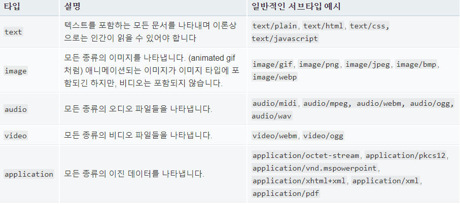
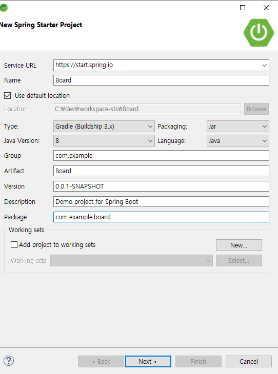
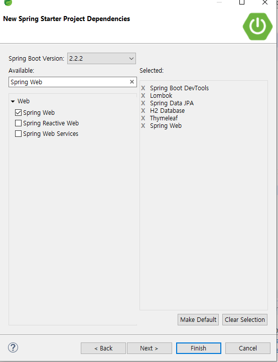
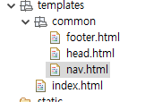
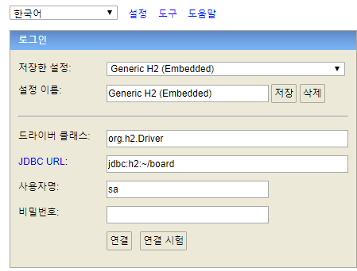

**복습 개념**


H2 Database (Data를 담는 프로그램)

날짜나 시간 사용자의 입장에 따라서 달라진 내용을 보여주려면 저장된 곳이 있어야 한다. Data를 담고 있는 곳.

장점 : 어디서든 접속할 수 있고, 여러 사람과 같이 수정할 수 있다. 

JPA : 조회 메소드 호출, 입력 메소드 호출. 하면 database 의 문법에 맞게 쓰여진다. 

---------

### import 하는 방법 

1. General 
   - Existing Projct..
2. Git
   - Projects from git
3. Gradle
   - Existing Gradle


-------------

```Java
package com.ggoreb.basic.repository;
import org.springframework.data.jpa.repository.JpaRepository;
import org.springframework.stereotype.Repository;
import com.ggoreb.basic.model.Product;
@Repository
public interface ProductRepository extends JpaRepository<Product, Long>{
}
```


`@Repository public interface ProductRepository extends JpaRepository <Product, Long>{ }`

JpaRepository로 부터 상속을 받은 자식 : ProductRespository

자식은 언제나 부모가 될 수 있다. 


JPA 는 DB를 다룸. DB는 테이블을 갖고 있음. 

Product 라는 테이블을 참조하고 이용했다.

Long 은 그 테이블이 가지고 있는 고유 아이디 (사람 : 주민번호 같은 것. )

```java
package com.ggoreb.basic.controller;
import java.util.List;
import org.springframework.beans.factory.annotation.Autowired;
import org.springframework.web.bind.annotation.GetMapping;
import org.springframework.web.bind.annotation.ModelAttribute;
import org.springframework.web.bind.annotation.PostMapping;
import org.springframework.web.bind.annotation.RestController;
import com.ggoreb.basic.model.Product;
import com.ggoreb.basic.repository.ProductRepository;
@RestController
public class JpaController {
@Autowired // 메모리에 만들어준 것을 불러옴. 스프링에서는 new 를 안씀. 바로 불러옴. 
ProductRepository productRepository;
@GetMapping("/jpa/product")
public List<Product> product() {
List<Product> list = productRepository.findAll();
return list;
}
@PostMapping("/jpa/product")
public String productPost(@ModelAttribute Product product) {
productRepository.save(product); //저장 호출 . 
return "redirect:/jpa/product";
}
}
```


restlet client로 post 방식으로 data 입력. 


@Controller @Service @Repository @Component

저절로 메모리에 등록되는 것들.

이렇게 등록하고 나면 다음에  new 객체 이렇게 안써도 된다.

@Autowired 를 써서 객체를 바로 입력하면 된다. 


------------


---------

## File Upload

```java
package com.start_spring.basic.controller;

import org.springframework.stereotype.Controller;
import org.springframework.web.bind.annotation.GetMapping;
import org.springframework.web.bind.annotation.PostMapping;
import org.springframework.web.bind.annotation.ResponseBody;
import org.springframework.web.multipart.MultipartFile;
import org.springframework.web.multipart.MultipartHttpServletRequest;

@Controller
public class UploadController {
	@GetMapping("/upload1")
	public String upload1() {
		return "upload1";
	}

	@PostMapping("/upload1")
	@ResponseBody
	public String upload1Post(MultipartHttpServletRequest mRequest) {
		String result = "";
		MultipartFile mFile = mRequest.getFile("file");
		String oName = mFile.getOriginalFilename();
		result += oName + "\n";
		return result;
	}
}
```


```html
<meta charset="utf-8">


<form method="post" enctype="multipart/form-data">
	<input type="file" name="file" multiple><br> <input
		type="submit" value="업로드">
</form>

```


```java
…
@GetMapping("/upload2")
public String upload2() {
return "upload2";
}
@PostMapping("/upload2")
@ResponseBody
public String upload2Post(@RequestParam("file") MultipartFile mFile) {
String result = "";

    //업로드 된 파일 정보
 MultipartFile mFile = mRequest.getFile("file");
    
String oName = mFile.getOriginalFilename();
    
    //지정된 경로에 지정 파일명으로 저장 
 mFile.transferTo(new File("c:/dev?"));
    
    //(surround try catch )
    

result += oName + "\n";
return result;
}
```


## file download

ResponseEntity.ok()

정상적으로 처리되었다는 200.

ResponseEntity.header("content-disposition", "filename"= ~~~~~~~)

브라우저에서 이러한 헤더값이 넘어가면 다운로드를 하게 됨. 

```java
package com.start_spring.basic.controller;

import java.io.File;
import java.io.FileInputStream;
import java.net.URLEncoder;
import org.springframework.core.io.InputStreamResource;
import org.springframework.core.io.Resource;
import org.springframework.http.MediaType;
import org.springframework.http.ResponseEntity;
import org.springframework.stereotype.Controller;
import org.springframework.web.bind.annotation.GetMapping;

@Controller
public class DownloadController {
	@GetMapping("/download")
	public ResponseEntity<Resource> download() throws Exception {
		File file = new File("C:\\dev\\HTML/a.html");
		InputStreamResource resource = new InputStreamResource(new FileInputStream(file));
		return ResponseEntity.ok()
				.header("content-disposition", "filename=" + URLEncoder.encode(file.getName(), "utf-8"))
				.contentLength(file.length()).contentType(MediaType.parseMediaType("application/octet-stream"))
				.contentType(MediaType.parseMediaType("text/plain"))
				.body(resource);
	}
}
```


MIME 타입 

출처 : https://developer.mozilla.org/ko/docs/Web/HTTP/Basics_of_HTTP/MIME_types




Spring 이 구동되면

클래스들이 독립적으로 존재한다. (메모리상 존재하고 있음 .)

이러한 독립적인 클래스를 가져다 쓸 수 있는 것이 @Autowired 


```java
package com.start_spring.basic.controller;

import java.util.Map;

import org.springframework.web.bind.annotation.GetMapping;
import org.springframework.web.bind.annotation.RestController;
import org.springframework.web.client.RestTemplate;

@RestController
public class RestTemplateController {
	@GetMapping("/getString")
 public Map getString() {
 
		RestTemplate rt = new RestTemplate();
 
		Map result = rt.getForObject("http://ggoreb.com/http/json1.jsp", Map.class);
 return result;
 }
}
```


## RestTemplate _ naver API 응용

```java
package com.start_spring.basic.controller;

import java.io.UnsupportedEncodingException;
import java.net.URI;
import java.net.URISyntaxException;
import java.net.URLEncoder;
import java.util.HashMap;
import java.util.Map;

import org.springframework.http.RequestEntity;
import org.springframework.http.ResponseEntity;
import org.springframework.web.bind.annotation.GetMapping;
import org.springframework.web.bind.annotation.RestController;
import org.springframework.web.client.RestTemplate;

@RestController
public class RestTemplateController {
	@GetMapping("/getString")
	public Map<String, Object> getString() {

		RestTemplate rt = new RestTemplate();

		Map<String, Object> result = rt.getForObject("http://ggoreb.com/http/json1.jsp", Map.class);
		return result;
	}

	@GetMapping("/getKakao")
	public ResponseEntity<Map> getKakao() {
		RestTemplate rt = new RestTemplate();
		RequestEntity requestEntity = null;
		try {
			requestEntity = RequestEntity
					.get(new URI("https://dapi.kakao.com/v2/local/search/address.json?query="
							+ URLEncoder.encode("부산 연 제구 연산동 1000", "utf-8")))
					.header("Authorization", "각자 API 키번호").build();
		} catch (UnsupportedEncodingException e) {
			e.printStackTrace();
		} catch (URISyntaxException e) {
			e.printStackTrace();
		}
		ResponseEntity<Map> entity = rt.exchange(requestEntity, Map.class);
		return entity;
	}

	@GetMapping("/getNaver")
	public ResponseEntity<Map> getNaver() {
		RestTemplate rt = new RestTemplate();
		RequestEntity<Map<String, String>> requestEntity = null;
		try {
			Map<String, String> body = new HashMap<>();
			body.put("source", "ko");
			body.put("target", "en");
			body.put("text", "안녕하세요. 저는 자바 개발자입 니다.");
			requestEntity = RequestEntity.post(new URI("https://openapi.naver.com/v1/papago/n2mt"))
					.header("X-Naver-Client-Id", "OpcnSsAIn37qIu6Iyad6").header("X-Naver-Client-Secret", "p7qtbsYx8N")
					.body(body);
		} catch (URISyntaxException e) {
			e.printStackTrace();
		}
		ResponseEntity<Map> entity = rt.exchange(requestEntity, Map.class);
		return entity;
	}

}
```


cdn :content delivery 


--------

## 게시판 만들기

### - 프로젝트 만들기 






### 회원가입 : Index.html  설정하기 

 https://www.w3schools.com → Learn Bootstrap → B3 → BS Templates 해당 템플릿 가져오기 

~~~html
<!DOCTYPE html>
<html lang="en">
<head>
  <title>Bootstrap Example</title>
  <meta charset="utf-8">
  <meta name="viewport" content="width=device-width, initial-scale=1">
  <link rel="stylesheet" href="https://maxcdn.bootstrapcdn.com/bootstrap/3.4.1/css/bootstrap.min.css">
  <script src="https://ajax.googleapis.com/ajax/libs/jquery/3.4.1/jquery.min.js"></script>
  <script src="https://maxcdn.bootstrapcdn.com/bootstrap/3.4.1/js/bootstrap.min.js"></script>
  <style>
    /* Remove the navbar's default margin-bottom and rounded borders */ 
    .navbar {
      margin-bottom: 0;
      border-radius: 0;
    }
    
    /* Add a gray background color and some padding to the footer */
    footer {
      background-color: #f2f2f2;
      padding: 25px;
    }
  </style>
</head>
<body>

<nav class="navbar navbar-inverse">
  <div class="container-fluid">
    <div class="navbar-header">
      <button type="button" class="navbar-toggle" data-toggle="collapse" data-target="#myNavbar">
        <span class="icon-bar"></span>
        <span class="icon-bar"></span>
        <span class="icon-bar"></span>                        
      </button>
      <a class="navbar-brand" href="#">Portfolio</a>
    </div>
    <div class="collapse navbar-collapse" id="myNavbar">
      <ul class="nav navbar-nav">
        <li class="active"><a href="#">Home</a></li>
        <li><a href="#">About</a></li>
        <li><a href="#">Gallery</a></li>
        <li><a href="#">Contact</a></li>
      </ul>
      <ul class="nav navbar-nav navbar-right">
        <li><a href="#"><span class="glyphicon glyphicon-log-in"></span> Login</a></li>
      </ul>
    </div>
  </div>
</nav>

<div class="jumbotron">
  <div class="container text-center">
    <h1>My Portfolio</h1>      
    <p>Some text that represents "Me"...</p>
  </div>
</div>
  
<div class="container-fluid bg-3 text-center">    
  <h3>Some of my Work</h3><br>
  <div class="row">
    <div class="col-sm-3">
      <p>Some text..</p>
      
    </div>
    <div class="col-sm-3"> 
      <p>Some text..</p>
      
    </div>
    <div class="col-sm-3"> 
      <p>Some text..</p>
      
    </div>
    <div class="col-sm-3">
      <p>Some text..</p>
      
    </div>
  </div>
</div><br>

<div class="container-fluid bg-3 text-center">    
  <div class="row">
    <div class="col-sm-3">
      <p>Some text..</p>
      
    </div>
    <div class="col-sm-3"> 
      <p>Some text..</p>
      
    </div>
    <div class="col-sm-3"> 
      <p>Some text..</p>
      
    </div>
    <div class="col-sm-3">
      <p>Some text..</p>
      
    </div>
  </div>
</div><br><br>

<footer class="container-fluid text-center">
  <p>Footer Text</p>
</footer>

</body>
</html>

~~~



기존 index.html 을 위와 같은 common 패키지 footer,head,nav 로 만들기.

1. head.html

```html

<head>
  <title>Bootstrap Example</title>
  <meta charset="utf-8">
  <meta name="viewport" content="width=device-width, initial-scale=1">
  <link rel="stylesheet" href="https://maxcdn.bootstrapcdn.com/bootstrap/3.4.1/css/bootstrap.min.css">
  <script src="https://ajax.googleapis.com/ajax/libs/jquery/3.4.1/jquery.min.js"></script>
  <script src="https://maxcdn.bootstrapcdn.com/bootstrap/3.4.1/js/bootstrap.min.js"></script>
  <style>
    /* Remove the navbar's default margin-bottom and rounded borders */ 
    .navbar {
      margin-bottom: 0;
      border-radius: 0;
    }
    
    /* Add a gray background color and some padding to the footer */
    footer {
      background-color: #f2f2f2;
      padding: 25px;
    }
  </style>
</head>

```

2. nav.html

```html


<nav class="navbar navbar-inverse">
  <div class="container-fluid">
    <div class="navbar-header">
      <button type="button" class="navbar-toggle" data-toggle="collapse" data-target="#myNavbar">
        <span class="icon-bar"></span>
        <span class="icon-bar"></span>
        <span class="icon-bar"></span>                        
      </button>
      <a class="navbar-brand" href="#">Portfolio</a>
    </div>
    <div class="collapse navbar-collapse" id="myNavbar">
      <ul class="nav navbar-nav">
        <li class="active"><a href="#">Home</a></li>
        <li><a href="#">About</a></li>
        <li><a href="#">Gallery</a></li>
        <li><a href="#">Contact</a></li>
      </ul>
      <ul class="nav navbar-nav navbar-right">
        <li><a href="#"><span class="glyphicon glyphicon-log-in"></span> Login</a></li>
      </ul>
    </div>
  </div>
</nav>


```

3. footer

```html


<footer class="container-fluid text-center">
  <p>Footer Text</p>
</footer>


```


맨 처음 실행할 때는 BoardApplication 에서 실행 .


데이터베이스(H2)를 이용하려면

모델( User 정보), repository  필요 




처음엔  Embedded 로 접속했다가 다시 나오고 다시 server 로 들어가야 한다.


```java
# datasource
spring.datasource.url=jdbc:h2:tcp://localhost/~/board
spring.datasource.driverClassName=org.h2.Driver
spring.datasource.username=sa
spring.datasource.password=
# jpa
spring.jpa.hibernate.ddl-auto=update //update 대신 create : 데이터베이스를 초기화 시킴 
spring.jpa.database-platform=org.hibernate.dialect.H2Dialect
spring.jpa.show-sql=true

```


1. sign in
2. sign up

3. sign out


-----------------------------

## 게시판 (글 쓰는 공간) 만들기

C - Create

R - Read (Retrieve)

U - Update (회원정보 수정)

D - Delete (회원탈퇴)


게시판은 데이터 베이스에 들어가야 하기 때문에 model 과 Repository 가 필요함. 

controller 주소 두개 필요함 (실제 쓰는 공간 )

@Autowired

HttpSessin session 


session.getAttribute("user_info") 이렇게 세션을 넣는 이유는 작성자(userId) 개념이 있는데, 회원가입과 로그인 기능 후에 로그인된 아이디로 글을 써야 하기 때문이다.  Session 으로부터 데이터를 받아와서 글을 쓴다. 

board.setUserId(userId)  위에서 세션에서 받아온 로그인 정보를 board 에 얹어 준다. 


